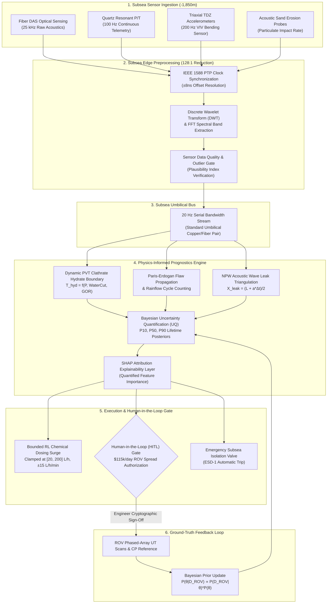

# SubseaGuard AI: Engineering Methodology & Physics Foundations
> **First-Principles Mechanical & Chemical Modeling, Bayesian Uncertainty Quantification, and Subsea Edge Inference for Deepwater Production Systems.**  
> *Compliant with API 17D, DNV-RP-F116, DNV-RP-F204, DNV-OS-F101, BS 7910, ISO 14224, and NACE MR0175.*

---

## 1. Executive Summary

Subsea hydrocarbon production at water depths of -1,850 m presents harsh hydrostatic pressures (up to 345 bar) and near-freezing ambient benthic temperatures (3.6°C). Unscheduled flowline or riser failures incur catastrophic financial costs (deepwater intervention spreads cost **$95,000 to $135,000/day**) and severe environmental consequences.

Most commercial predictive maintenance dashboards rely on black-box machine learning trained on generic run-to-failure vibration datasets (e.g., NASA turbofan datasets). These models fail in subsea environments where failure events are rare, operating points drift with reservoir composition, and false alarms incur six-figure mobilization costs.

**SubseaGuard AI** couples continuous high-frequency subsea telemetry with first-principles physical laws:
1. **Linear Elastic Fracture Mechanics (LEFM)**: Paris-Erdogan flaw propagation ($da/dN = C(\Delta K)^m$) driven by cross-flow Vortex-Induced Vibration (VIV) modal lock-in.
2. **Dynamic Compositional PVT Thermodynamics**: Clathrate hydrate phase equilibrium shifting dynamically with field Water Cut (WC) and Gas-to-Oil Ratio (GOR).
3. **Acoustic Wave Speed Triangulation**: Negative Pressure Wave (NPW) time-of-flight on fiber Distributed Acoustic Sensing (DAS) synchronized via nanosecond IEEE 1588 PTP.
4. **Bayesian Uncertainty Quantification (UQ)**: Remaining Useful Life (RUL) quantified into actionable P10, P50, and P90 confidence bounds, updated through bidirectional ROV ground-truth inspection calibration.
5. **Subsea Edge Compression (128:1)**: Discrete Wavelet Transforms (DWT) reducing 25 kHz acoustic data to 20 Hz telemetry over bandwidth-constrained umbilicals.
6. **Human-in-the-Loop (HITL) Gate**: Mandatory cryptographic engineer sign-off preventing autonomous false-positive vessel dispatch.

---

## 2. Structural Fracture Mechanics & VIV Lock-in

```
               ▲ Transverse Vortex Shedding (f_s ≈ 0.38 Hz)
               │     ~~~
               │    ~   ~  (Benthic Current U = 1.85 kts)
═══════════════╪═════════════════════════════════════════════► Flow Direction
               │    ~   ~
               ▼     ~~~
       Dynamic Cyclic Bending Stress: Δσ = 160 MPa (Peak = 245 MPa)
       Accelerated Crack Extension: da/dN = C · (Y · Δσ · √(π·a))^m
```

### 2.1 Paris-Erdogan Flaw Propagation Formulation
Subsea Steel Catenary Risers (SCR-01) undergo millions of wave- and current-induced bending reversals at the seabed touchdown zone (TDZ at KP 2.85). Subcritical flaw extension follows the Paris-Erdogan power law:

$$\frac{da}{dN} = C \cdot (\Delta K)^m$$

Where the stress intensity factor range $\Delta K$ is given by:

$$\Delta K = Y \cdot \Delta \sigma \cdot \sqrt{\pi a}$$

- $a$: Crack depth ($mm$)
- $N$: Number of elapsed stress reversal cycles
- $\Delta\sigma$: Cyclic bending stress range ($MPa$)
- $Y$: Geometric boundary correction factor ($Y = 1.12$ for external semi-elliptical surface flaws in thick-walled pipes)
- $\Delta K_{th}$: Threshold stress intensity factor below which flaw growth is negligible

### 2.2 Material Constants (BS 7910 / DNV-RP-F108)
For DNV-OS-F101 SAWL 450 (X65 Super Duplex clad) welded marine steel cathodically protected in seawater:

| Parameter | Symbol | Value | Units | Engineering Basis |
| :--- | :---: | :---: | :---: | :--- |
| **Paris Constant** | $C$ | $5.21 \times 10^{-13}$ | $\text{mm/cycle}\cdot(\text{MPa}\sqrt{\text{m}})^{-3}$ | BS 7910 Mean + 2SD Curve |
| **Paris Exponent** | $m$ | $3.00$ | dimensionless | Stage II Linear Elastic Regime |
| **Threshold Stress Intensity** | $\Delta K_{th}$ | $2.00$ | $\text{MPa}\sqrt{\text{m}}$ | Environmental cutoff |
| **Critical Flaw Depth** | $a_{\text{crit}}$ | $8.50$ | $\text{mm}$ | API 579 Level 3 Plastic Collapse |
| **Inspection Dispatch Flaw** | $a_{\text{insp}}$ | $2.00$ | $\text{mm}$ | Autonomous CBI mobilization trigger |
| **Initial Detection Limit** | $a_0$ | $0.45$ | $\text{mm}$ | High-resolution phased-array UT limit |

### 2.3 Vortex-Induced Vibration (VIV) Lock-in at 0.38 Hz
Deepwater benthic current flow ($U = 1.85\ \text{knots} \approx 0.95\ \text{m/s}$) creates alternating vortex shedding across the outer diameter of the SCR ($D_o = 12.75\ \text{in} = 0.32385\ \text{m}$). The Strouhal shedding frequency is:

$$f_s = \frac{St \cdot U}{D_o} = \frac{0.19 \times 0.95}{0.32385} \approx 0.557\ \text{Hz}$$

As benthic current velocities vary between 1.2 and 1.85 knots, vortex shedding locks into the **2nd transverse natural bending mode** ($f_{n2} = 0.38\ \text{Hz}$) of the catenary arc.

During modal lock-in:
1. Cross-flow oscillation amplitude jumps to $A_y / D_o \approx 0.85$.
2. The dynamic curvature $\kappa = \frac{d^2w}{ds^2}$ induces cyclic bending strain $\Delta\epsilon = \frac{D_o}{2}\cdot\kappa$.
3. Dynamic stress range spikes to $\Delta\sigma = E \cdot \Delta\epsilon \approx 160\ \text{MPa}$, with peak TDZ bending stress reaching **245 MPa**.

$$\text{Crack Growth Acceleration Factor} = \left(\frac{\Delta\sigma_{\text{lock-in}}}{\Delta\sigma_{\text{nominal}}}\right)^m = \left(\frac{160\ \text{MPa}}{42\ \text{MPa}}\right)^{3.0} \approx \mathbf{55.3\times}$$

A structural design fatigue life of 25 years collapses to approximately **42 days (P10 = 26 days)** under sustained benthic current loop lock-in.

### 2.4 Rainflow Cycle Counting & Palmgren-Miner Rule
Prior to macro-crack propagation, stochastic stress reversals are counted using the ASTM E1049-85 Rainflow cycle counting algorithm and summed against DNV-RP-C203 Curve F3:

$$D = \sum_{i=1}^{k} \frac{n_i}{N_i} \le \frac{1}{\text{DFF}}$$

Where the Design Fatigue Factor $\text{DFF} = 10.0$ for non-retrievable subsea touchdown zones.

---

## 3. Dynamic PVT Hydrate Phase Equilibrium

```
   Pressure (bar)
        ▲
    350 ┼───────────────────────.───────────────
        │                      /  \
    250 ┼─────────.───────────/────\────────────  Operating Baseline: (215 bar, 52.4°C) [SAFE]
        │        /           /      \
    150 ┼───────/───────────/        \
        │      / HYDRATE   /          \
     50 ┼─────/  STABLE   /  OPERATING \
        │    /   ZONE    /     REGION   \
      0 ┼───┴───────────┴──────────────────────► Temperature (°C)
           0°C         14.5°C                 60°C
                    T_hyd(P)
```

### 3.1 Thermodynamic Equilibrium Formulation
Methane and light hydrocarbons form solid clathrate crystals (Structure sII) under high hydrostatic pressure and low seabed ambient temperature (3.6°C). Conventional tools assume a static equilibrium curve. SubseaGuard AI computes a dynamic equilibrium curve that shifts with field Water Cut (WC) and Gas-to-Oil Ratio (GOR):

$$T_{\text{hyd}}(P) = 8.9 \cdot \log_{10}(P) + 0.018 \cdot P - 7.5 + \Delta T_{\text{PVT}}(\text{WC}, \text{GOR})$$

Where:

$$\Delta T_{\text{PVT}} = (\text{WC} - 10) \times 0.12 + (\text{GOR} - 1500) \times 0.002 \quad (^{\circ}\text{C})$$

### 3.2 Subcooling Margin & Risk Criterion
The instantaneous subcooling driving force is:

$$\Delta T_{\text{sub}} = T_{\text{fluid}} - T_{\text{hyd}}(P)$$

- $\Delta T_{\text{sub}} > +3.0^{\circ}\text{C}$: **OPTIMAL** (Adequate thermal buffer).
- $0.0^{\circ}\text{C} \le \Delta T_{\text{sub}} \le +3.0^{\circ}\text{C}$: **WARNING** (Metastable induction zone).
- $\Delta T_{\text{sub}} < 0.0^{\circ}\text{C}$: **CRITICAL BLOCKAGE RISK** (Spontaneous hydrate crystallization and wall deposition).

In scenario `HYDRATE_RISK`, $T_{\text{fluid}} = 7.8^{\circ}\text{C}$ while $T_{\text{hyd}}(195\ \text{bar}) = 14.5^{\circ}\text{C}$, producing a severe subcooling deficit of **$\Delta T_{\text{sub}} = -6.7^{\circ}\text{C}$**.

### 3.3 Thermodynamic Inhibition (MEG) — Hammerschmidt Equation
The freezing point depression required to suppress hydrate formation using Monoethylene Glycol (MEG) inhibitor is computed via the Hammerschmidt equation:

$$\Delta T_{\text{freeze}} = \frac{K_h \cdot W}{M \cdot (100 - W)}$$

- $K_h = 1297$ (Hammerschmidt constant for MEG)
- $M = 62.07\ \text{g/mol}$ (Molecular weight of MEG)
- $W$: Weight percent of MEG in the free aqueous phase

**RL Dosing Guardrails**: An autonomous Reinforcement Learning (RL) dosing agent commands inhibitor pump rate $Q(t)$. To prevent hydraulic hammer and umbilical over-pressurization, the policy is clamped by hard safety envelopes:
- $Q(t) \in [20, 200]\ \text{L/h}$
- $|\frac{dQ}{dt}| \le 15\ \text{L/h/min}$

---

## 4. Bayesian Uncertainty Quantification (UQ)

### 4.1 Definition of P10, P50, and P90 Quantiles
In safety-critical subsea integrity, deterministic RUL predictions give a false sense of precision. SubseaGuard AI computes full posterior probability distributions for time-to-failure:

```
Probability Density f(t)
    ▲
    │          P10 (68d)         P50 (88d)           P90 (104d)
    │           [DISPATCH]        [MEDIAN]            [UPPER]
    │              │                 │                   │
    │              ▼                 ▼                   ▼
    │            .---.            .-----.              .---.
    │           /     \          /       \            /     \
    │      ____/       \________/         \__________/       \____
    └──────────┬─────────────────────┬───────────────────┬────────► Time (Days)
             P10 (10% Fail)       P50 (Median)        P90 (90% Fail)
```

- **P10 (10th percentile / 90% survival probability)**: Conservative lower bound. Only a 10% chance that the asset fails before this time. **This is the operational dispatch threshold.** If $P_{10} \le 60\ \text{days}$, ROV mobilization is scheduled immediately because waiting for P50 risks catastrophic failure.
- **P50 (50th percentile / Median)**: Central mathematical expectation under prevailing telemetry trends. Used for quarterly financial forecasting and supply chain planning.
- **P90 (90th percentile / 10% survival probability)**: Optimistic upper lifetime horizon under ideal cathodic protection and low fluid velocity.

### 4.2 Degradation Prior & Bayesian Updating
Asset degradation paths are parameterized using a 2-parameter Weibull lifetime model:

$$R(t) = \exp\left(-\left(\frac{t}{\eta}\right)^\beta\right)$$

- $\eta$: Scale parameter (characteristic life in days)
- $\beta$: Shape parameter ($\beta > 1$ represents progressive aging / wear-out)

The prior distribution on parameters $\theta = (\eta, \beta) \sim \mathcal{N}(\mu_0, \Sigma_0)$ is established from historical OREDA subsea databases. When an ROV conducts a targeted non-destructive testing (NDT) scan (e.g. ultrasonic wall thickness $y_{\text{ROV}}$ at KP 12.4), the likelihood function updates the model:

$$P(\theta \mid y_{\text{ROV}}) = \frac{P(y_{\text{ROV}} \mid \theta) \cdot P(\theta)}{\int P(y_{\text{ROV}} \mid \theta) \cdot P(\theta)\, d\theta}$$

**Result**: Ground-truth calibration collapses posterior variance, tightening the P10–P90 confidence envelope and eliminating unmonitored model drift.

---

## 5. Negative Pressure Wave (NPW) Acoustic Leak Localization

### 5.1 Acoustic Wave Speed in Multiphase Medium
When a containment breach occurs, depressurization creates acoustic rarefaction waves traveling toward both ends of the flowline at sonic velocity $a$:

$$a = \sqrt{\frac{K_{\text{fluid}} / \rho_{\text{fluid}}}{1 + \frac{K_{\text{fluid}} \cdot D_i}{E_{\text{steel}} \cdot t_{\text{wall}}}}}$$

For Block-4 multiphase crude ($GOR = 1680\ \text{scf/stb}, WC = 14.2\%$), $a \approx 1080\ \text{m/s}$.

### 5.2 Time-of-Flight Localization
Using time synchronization across the 12.4 km flowline:

$$X_{\text{leak}} = \frac{L + a \cdot (t_{\text{outlet}} - t_{\text{inlet}})}{2}$$

- $L = 12.4\ \text{km}$
- $t_{\text{outlet}} - t_{\text{inlet}}$: Measured arrival time delta

### 5.3 IEEE 1588 PTP Clock Sync Precision
Heterogeneous acoustic sensors (quartz gauges and fiber DAS) are synchronized using IEEE 1588 Precision Time Protocol (PTP):

$$\text{Jitter Offset: } |t_{\text{NPW}} - t_{\text{quartz}}| < 15\ \text{ns} \implies \text{Theoretical Spatial Uncertainty } \pm 16.2\ \text{mm}$$

Cross-validated with inlet/outlet Venturi mass flowmeters ($\Delta\dot{m} = 1.85\ \text{kg/s}$ discrepancy) and subsea optical hydrocarbon sniffers ($145\ \text{ppm-m}$ methane plume), preventing spurious ESD shutdowns from normal valve actuation transients.

---

## 6. End-to-End Edge Architecture Pipeline



### Why Subsea Edge Wavelet Compression (128:1) is Mandatory
- **Raw Acoustic Throughput**: A single fiber DAS acoustic channel sampling at 25.6 kHz produces over **$48\ \text{MB/s}$** of raw uncompressed telemetry.
- **Umbilical Bottleneck**: Deepwater umbilicals routed 15+ km back to topside facilities provide constrained telemetry bandwidth shared across power, safety interlocks, and hydraulics.
- **Solution**: Subsea canisters deployed at the seabed PLET perform Discrete Wavelet Transforms (DWT, Daubechies db4) and FFT spectral power extraction directly at the seabed. The data is compressed into **20 Hz wavelet packet statistics (128:1 reduction ratio)**, preserving acoustic transient wave fronts for NPW leak detection without saturating the umbilical bus.

### The Human-in-the-Loop (HITL) Gate Rationale
Offshore inspection vessels equipped with work-class ROVs cost between **$95,000 and $135,000 per day** plus mobilization and fuel expenses. Unilaterally triggering physical intervention based solely on machine learning inference risks substantial financial loss from sensor anomalies or marine growth interference. 

SubseaGuard AI enforces a mandatory **Human-in-the-Loop authorization gate**:
- The model generates an auditable inspection dossier containing sensor evidence, Bayesian P10/P50/P90 confidence bounds, and SHAP feature attributions.
- A cryptographic authorization hash is generated.
- The Chief Subsea Integrity Engineer must formally review and sign off before vessel spread mobilization is triggered.

---

## 7. ISO 14224 Equipment Taxonomy & Failure Classification

SubseaGuard AI aligns all digital twin components, sensor telemetry, and work orders with **ISO 14224:2016** (*Petroleum, petrochemical and natural gas industries — Collection and exchange of reliability and maintenance data for equipment*):

| ISO Level | System / Equipment | Asset ID | ISO Failure Mode (FMC) | AI Detection Mechanism | Standardized Mitigation |
| :--- | :--- | :--- | :--- | :--- | :--- |
| **Level 4** | Production Flowline | `PFL-101` | **PLUG** (Hydrate Blockage) | Dynamic PVT Subcooling Margin ($\Delta T_{\text{sub}} < 0$) | Clamped RL MEG surge + trace heating |
| **Level 4** | Steel Catenary Riser | `SCR-01` | **BRKD** (Fatigue Breakdown) | 0.38 Hz VIV Accelerometer Peak + Rainflow | Top-tension trim + Phased-Array UT |
| **Level 4** | Flowline PLET Elbow | `PFL-101` | **ERO** (Wall Thinning) | Acoustic Sand Monitor ($> 15\ \text{PPM}$) + Salama | Choke trim + HITL ROV UT scan |
| **Level 4** | Seabed Route Pipe | `PFL-101` | **ELK** (External Hydrocarbon Leak) | NPW Time-of-Flight + Mass Deficit | Emergency Subsea Isolation ESD-1 |
| **Level 4** | Flowline Cold Section | `PFL-101` | **RES** (Wax Hydraulic Restriction) | WAT Subcooling ($T < 37.5^{\circ}\text{C}$) + $\Delta P$ surge | Condition-based intelligent pigging |
| **Level 5** | Riser Flex-Joint | `SCR-01-FJ` | **FTG** (Cyclic Wear) | Angular inclinometer ($\theta_{\text{RMS}} > 2.2^{\circ}$) | Dynamic stiffness verification |

---

## 8. Standards Compliance & References

1. **API Specification 17D**: *Design and Operation of Subsea Production Systems — Subsea Wellhead and Tree Equipment*, 3rd Edition.
2. **DNV-RP-F116**: *Integrity Management of Subsea Production Systems*, Det Norske Veritas.
3. **DNV-RP-F204**: *Riser Fatigue Structural Health Monitoring and Integrity Management*.
4. **DNV-OS-F101**: *Submarine Pipeline Systems*.
5. **BS 7910:2019**: *Guide to Methods for Assessing the Acceptability of Flaws in Metallic Structures*, British Standards Institution.
6. **ISO 14224:2016**: *Petroleum, petrochemical and natural gas industries — Collection and exchange of reliability and maintenance data for equipment*.
7. **NACE MR0175 / ISO 15156**: *Petroleum and natural gas industries — Materials for use in H2S-containing environments in oil and gas production*.
8. **API Recommended Practice 14E**: *Recommended Practice for Design and Installation of Offshore Production Platform Piping Systems (Erosional Velocity Limits)*.
9. **ASTM E1049-85**: *Standard Practices for Cycle Counting in Fatigue Analysis (Rainflow Counting)*.

---

*Authored for the SubseaGuard AI Deepwater Operations Platform • Licensed under MIT.*
