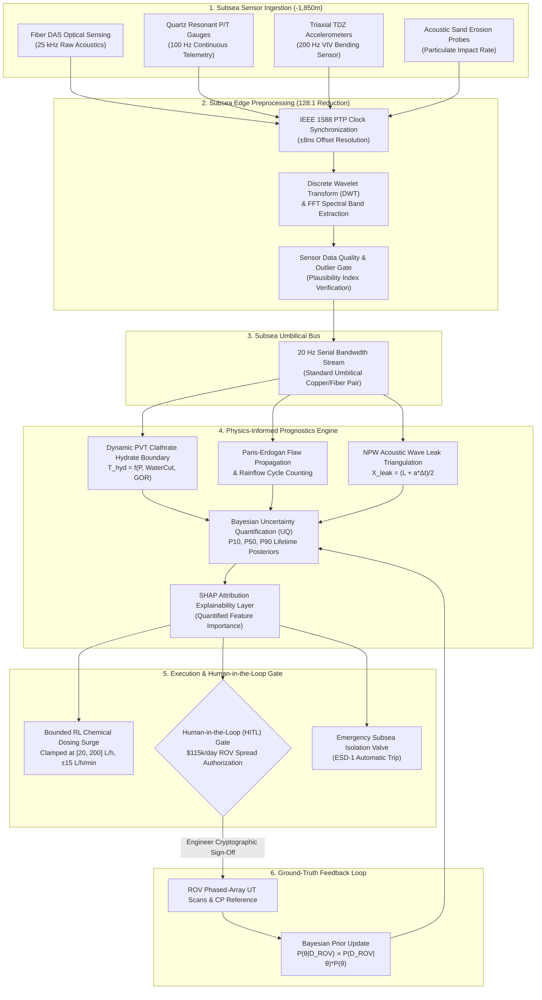

# SubseaGuard AI: Physics-Informed Predictive Maintenance & Digital Twin for Deepwater Subsea Systems

> **Industrial-grade digital twin, first-principles prognostics, Bayesian uncertainty quantification (P10/P50/P90), and edge telemetry platform for subsea flowlines and steel catenary risers at -1,850 m depth.**

[](https://subseaguard.dev)
[](https://github.com/ROAESUBMARS/subsea-ai-predictive-maintenance/actions/workflows/ci.yml)
[](https://subseaguard.dev)
[](https://subseaguard.dev)
[](https://react.dev/)
[](https://vitejs.dev/)
[](https://tailwindcss.com/)
[](./METHODOLOGY.md)
[](LICENSE)

---

## 🌊 1. Problem Statement & Operational Context

Deepwater subsea oil & gas operations operate under extreme hydrostatic pressures (**up to 345 bar / 5,000 psi**) and near-freezing ambient benthic temperatures (**3.6°C / 38.5°F**) at water depths exceeding **-1,850 meters (-6,070 ft)**. 

### Why Generic AI Dashboards Fail in Subsea Operations
1. **Catastrophic Failure Consequences**: A subsea flowline rupture or riser disconnect causes severe environmental blowouts and production loss exceeding **$1.8M/day**.
2. **Extreme Intervention Cost**: Deepwater intervention vessels and work-class Remotely Operated Vehicles (ROVs) cost **$95,000 to $135,000 per day** plus mobilization fees. False-positive dispatches waste hundreds of thousands of dollars.
3. **Data Scarcity**: Unlike manufacturing plant bearings, subsea production lines do not have thousands of historical run-to-failure examples. Black-box neural networks trained on generic datasets cannot generalize to evolving reservoir Water Cut (WC) or benthic vortex lock-in.

**SubseaGuard AI** bridges this gap by embedding **first-principles marine engineering, fracture mechanics, and multiphase thermodynamics** directly into the predictive monitoring loop.

---

## ⚙️ 2. What is Simulated vs. What is Computed (Engineering Transparency)

To maintain absolute technical integrity, the table below explicitly delineates which elements are simulated boundary conditions versus which are computed in real time using physical formulations:

| Engineering Dimension | Classification | Methodology & Governing Formulation |
| :--- | :---: | :--- |
| **Benthic Ocean Currents & Loop Eddies** | `Simulated` | Deepwater current profiles (1.2 to 1.85 knots) generated with stochastic benthic turbulence at -1,850 m. |
| **Reservoir Multiphase Fluid Inflow** | `Simulated` | Time-varying reservoir pressure (195–220 bar), Water Cut (14.2–28.5%), and GOR (1680–2200 scf/stb). |
| **VIV Resonant Lock-in Detection** | `Computed` | Strouhal shedding frequency $f_s = \frac{St \cdot U}{D_o}$ calculated in real time; detects synchronization with 2nd transverse natural bending mode ($f_{n2} = 0.38\ \text{Hz}$). |
| **Dynamic Cyclic Bending Stress** | `Computed` | FEA beam curvature formulation $\kappa = \frac{d^2w}{ds^2}$ mapping transverse displacement into cyclic stress range $\Delta\sigma = E \cdot \frac{D_o}{2} \cdot \kappa \approx 160\ \text{MPa}$ (peak 245 MPa). |
| **Rainflow Stress Cycle Counting** | `Computed` | ASTM E1049-85 Rainflow algorithm binning stress reversals and computing Palmgren-Miner cumulative damage $D = \sum n_i / N_i$ against DNV-RP-C203 Curve F3. |
| **Paris-Erdogan Crack Growth** | `Computed` | Linear Elastic Fracture Mechanics (LEFM): $\frac{da}{dN} = C(\Delta K)^m = C(Y \Delta\sigma \sqrt{\pi a})^m$ evaluated with BS 7910 welded marine steel constants. |
| **Dynamic PVT Hydrate Phase Envelope** | `Computed` | Clathrate thermodynamic boundary $T_{\text{hyd}}(P) = 8.9\log_{10}(P) + 0.018P - 7.5 + \Delta T_{\text{PVT}}(\text{WC}, \text{GOR})$ updated as reservoir fluid composition shifts. |
| **Thermodynamic Inhibitor (MEG) Dosing** | `Computed` | Hammerschmidt freezing point depression $\Delta T_{\text{freeze}} = \frac{K_h W}{M (100 - W)}$ evaluated under bounded RL rate limits ($\pm 15\ \text{L/h/min}$). |
| **Negative Pressure Wave (NPW) Leak Location** | `Computed` | Time-of-flight acoustic wave speed triangulation $X_{\text{leak}} = \frac{L + a \cdot \Delta t}{2}$ with IEEE 1588 PTP nanosecond time synchronization ($a \approx 1080\ \text{m/s}$). |
| **Bayesian Uncertainty Quantification (UQ)** | `Computed` | Weibull degradation path posteriors updated via Bayes' theorem: $P(\theta \mid D_{\text{ROV}}) \propto P(D_{\text{ROV}} \mid \theta) P(\theta)$, yielding explicit **P10, P50, and P90** confidence bounds. |
| **Subsea Edge Wavelet Compression** | `Computed` | Discrete Wavelet Transform (DWT, Daubechies db4) reducing raw 25 kHz DAS acoustics to 20 Hz wavelet packet statistics (**128:1 bandwidth compression**). |
| **Human-in-the-Loop (HITL) Authorization** | `Gated` | Cryptographic sign-off token requiring Lead Subsea Integrity Engineer authorization before dispatching $115k/day ROV spreads. |

---

## 🏛️ 3. End-to-End System Architecture



---

## 🔬 4. Physics & Governing Formulations

### 4.1 Paris-Erdogan Fatigue Flaw Growth (BS 7910)
$$\frac{da}{dN} = C \cdot (\Delta K)^m = C \cdot \left( Y \cdot \Delta\sigma \cdot \sqrt{\pi a} \right)^m$$
- **Material Constants**: $C = 5.21 \times 10^{-13}\ \text{mm/cycle}\cdot(\text{MPa}\sqrt{\text{m}})^{-3}$, $m = 3.00$ (Stage II linear elastic regime for welded SAWL 450 steel in seawater with CP).
- **Geometric Correction**: $Y = 1.12$ (semi-elliptical surface crack).
- **Critical Flaw Depth**: $a_{\text{crit}} = 8.50\ \text{mm}$ (API 579 Level 3 plastic collapse threshold).

### 4.2 Vortex-Induced Vibration (VIV) Lock-in
$$f_s = \frac{St \cdot U}{D_o} \approx 0.38\ \text{Hz} \implies \text{Lock-in into 2nd Transverse Bending Mode}$$
- Cross-flow oscillation amplitude ratio $A_y / D_o \approx 0.85$.
- Cyclic bending stress range $\Delta\sigma = 160\ \text{MPa}$ accelerates flaw propagation rate by **$\approx 55.3\times$** over nominal wave loading.

### 4.3 Dynamic PVT Clathrate Hydrate Phase Boundary
$$T_{\text{hyd}}(P) = 8.9 \cdot \log_{10}(P) + 0.018 \cdot P - 7.5 + \Delta T_{\text{PVT}}(\text{WC}, \text{GOR})$$
$$\Delta T_{\text{PVT}} = (\text{WC} - 10) \times 0.12 + (\text{GOR} - 1500) \times 0.002 \quad (^{\circ}\text{C})$$
- Subcooling driving force: $\Delta T_{\text{sub}} = T_{\text{fluid}} - T_{\text{hyd}}(P)$.
- Hydrate crystallization and pipe wall deposition initiate when $\Delta T_{\text{sub}} < 0.0^{\circ}\text{C}$.

### 4.4 Bayesian Uncertainty Quantification (UQ)
$$P(\theta \mid D_{\text{ROV}}) \propto P(D_{\text{ROV}} \mid \theta) \cdot P(\theta)$$
- **P10 (10th percentile / 90% survival probability)**: Conservative lower limit used for safety-critical inspection dispatch ($P_{10} \le 60\ \text{days}$).
- **P50 (Median expected lifetime)**: Central engineering planning estimate.
- **P90 (90th percentile / 10% survival probability)**: Upper bound under optimal passivation.

---

## 🚀 5. Key Interactive Features

### 5.1 Engineering Methodology Whitepaper (`/methodology`)
A publication-grade technical whitepaper integrated directly into the web application, featuring:
- Rigorous mathematical derivations for fracture mechanics, VIV shedding, dynamic PVT curves, and NPW acoustic localization.
- **Interactive Sample Charts**: Dynamic PVT Hydrate Phase Envelope, Bayesian RUL Fan Chart with P10/P50/P90 uncertainty envelopes, and Paris-Erdogan flaw propagation ($a$ vs $N$).
- Material constant reference tables (BS 7910, API 14E, ISO 14224).
- Single-click **Download Markdown Whitepaper** and **Print / PDF View**.

### 5.2 90-Second Guided Tour Mode
Curated specifically for technical recruiters and engineering reviewers who spend ~2 minutes evaluating projects. Hits the 3 premier scenarios:
1. **Dynamic PVT Hydrate Risk & Bounded RL MEG Dosing** (`PFL-101`)
2. **SCR Catenary Touchdown Fatigue & 0.38 Hz VIV Lock-in** (`SCR-01`)
3. **Choke Sand Breakthrough & Erosion Wall Thinning** (`PFL-101`)
Includes automated step transitions, a 30-second countdown timer per scenario, and focused engineering takeaways.

### 5.3 Interactive Time Controls & Timeline Scrubber
- **Play / Pause** real-time simulation.
- **Speed Multipliers**: `0.5x`, `1x (Realtime)`, `2x`, `5x`, `10x`.
- **Interactive Scrubber**: Drag through recorded simulation frames to watch RUL posteriors, crack growth curves, and wall thinning evolve dynamically across time!
- **Instant Live Return**: Dedicated return-to-live sync button.

### 5.4 Teachable Anomaly Annotations Panel ("Why the Model Flagged This")
When an anomaly occurs, an explanatory diagnostics panel breaks down:
- **Threshold Crossings**: Compares measured values against physical limits (e.g. Acoustic Sand $84.5\ \text{PPM} > 15.0\ \text{PPM}$, Fluid velocity $11.8\ \text{m/s} > 8.2\ \text{m/s}$).
- **Bayesian Posterior Shift**: Prior nominal (450 days) $\to$ Posterior Median (88 days) $\to$ P10 Dispatch Limit (68 days).
- **Governing Physics Equation**: Rendered LaTeX/monospace formula for the active failure mechanism.
- **SHAP Feature Attributions**: Bar chart showing % contribution of each telemetry stream.
- **HITL Gate Status**: Explains the local edge clamp vs the human authorization gate.

---

## 💻 6. Getting Started Locally

### Prerequisites
- [Node.js](https://nodejs.org/) (v18.0 or higher recommended)
- [npm](https://www.npmjs.com/) (v9.0 or higher)

### Installation & Run

1. Clone the repository:
   ```bash
   git clone https://github.com/ROAESUBMARS/subsea-ai-predictive-maintenance.git
   cd subsea-ai-predictive-maintenance
   ```

2. Install dependencies:
   ```bash
   npm install
   ```

3. Launch development server:
   ```bash
   npm run dev
   ```
   Open `http://localhost:5173` in your browser.

4. Production Build:
   ```bash
   npm run build
   npm run preview
   ```

---

## 📂 7. Project Structure

```
├── .github/workflows/ci.yml       # GitHub Actions automated CI matrix (Node 20.x, 22.x)
├── METHODOLOGY.md                 # Full engineering whitepaper & mathematical derivations
├── LINKEDIN_ARTICLE.md            # Publication-grade technical engineering article
├── WALKTHROUGH.md                 # Master Engineering Walkthrough (Phases 1, 2, 3 & 4)
├── README.md                      # Primary project overview & architecture specification
├── index.html                     # Pre-rendered static landing page & recruiter portal (Zero JS)
├── app/
│   └── index.html                 # Operational console entry point (React 18 SPA)
├── package.json                   # Dependencies (React 18, Vite 5, TailwindCSS, Chart.js)
├── tailwind.config.js             # Industrial design tokens, colors & typography
├── postcss.config.js              # PostCSS plugins (Tailwind, Autoprefixer)
├── vite.config.js                 # Multi-page build & /app/ internal rewrite routing plugin
├── vercel.json                    # Vercel deployment config & strict security headers
├── tests/
│   ├── physics.test.js            # Node native unit tests for Paris LEFM, UQ & hydrate boundary
│   └── scenarios.test.js          # Node native tests for telemetry scenarios & HITL gate
├── public/
│   ├── manifest.json              # PWA Web App Manifest (standalone, offline ready)
│   ├── sw.js                      # Service Worker for stale-while-revalidate offline caching
│   ├── robots.txt                 # Search crawler indexing rules
│   ├── sitemap.xml                # Canonical XML sitemap with /methodology
│   └── og.png                     # 1200x630 high-resolution social share card
└── src/
    ├── App.jsx                    # Root client-side SPA routing & state coordinator
    ├── index.css                  # Tailwind directives, dark theme tokens & reduced-motion rules
    ├── components/
    │   ├── MethodologyView.jsx    # Engineering whitepaper page with interactive plots
    │   ├── ScenarioAnnotationPanel.jsx # "Why the model flagged this" explainability panel
    │   ├── TimeControlsHUD.jsx    # Timeline scrubber & 0.5x-10x acceleration controls
    │   ├── GuidedTourModal.jsx    # 90-second automated walkthrough of top 3 scenarios
    │   ├── IndustrialControlRoomDashboard.jsx # 5-zone real-time operations dashboard
    │   ├── FlowlineRiserIntegrityHub.jsx      # Spatial KP profiles & bathymetric route
    │   ├── DigitalTwinHub.jsx                 # 2D/3D FEM pipe-in-pipe schematic
    │   ├── RiserFatigueStructuralHealth.jsx   # Paris crack growth & VIV spectrum
    │   ├── FlowAssuranceOptimizer.jsx         # Dynamic hydrate phase boundary
    │   ├── EarlyLeakDetectionHub.jsx          # NPW acoustic & mass balance leak hub
    │   ├── CorrosionErosionPrognostics.jsx    # UT wall thickness & sand acoustics
    │   ├── ConditionBasedInspectionROI.jsx    # $3.83M OPEX savings & carbon reduction
    │   ├── ROVDeploymentHub.jsx               # Work order dispatch & dive checklists
    │   ├── AlertingAndEscalationHub.jsx       # Tiered alarms & automated escalation
    │   ├── ReportGeneratorModal.jsx           # ISO 14224:2016 JSON dossier & print exporter
    │   ├── ArchitectureModal.jsx              # 5-stage edge-to-cloud pipeline diagram
    │   ├── AssetDetailModal.jsx               # Subsea equipment node telemetry inspection
    │   ├── NotFound.jsx                       # Industrial glassmorphic 404 route link
    │   └── Navbar.jsx                         # Sticky header with scenario & role switchers
    └── services/
        ├── fractureMechanics.js   # BS 7910 Paris-Erdogan numerical crack solver & UQ
        └── telemetryEngine.js     # Physics simulation engine, UQ, and scenario states
```

---

## 📋 8. Regulatory Standards Compliance

- **API Specification 17D**: Design and Operation of Subsea Production Systems.
- **DNV-RP-F116**: Integrity Management of Subsea Production Systems.
- **DNV-RP-F204**: Riser Fatigue Structural Health Monitoring.
- **BS 7910:2019**: Guide to Methods for Assessing Flaw Acceptability in Metallic Structures.
- **ISO 14224:2016**: Reliability and Maintenance Data Collection for Equipment.
- **NACE MR0175 / ISO 15156**: Materials for Use in H2S-Containing Environments.
- **API RP 14E**: Recommended Practice for Offshore Platform Piping Erosional Limits.

---

## 📄 License & Citation

This project is licensed under the **MIT License** — see the [LICENSE](LICENSE) file for details.

### Citation Format
```bibtex
@misc{subseaguard_ai_2026,
  author = {SubseaGuard AI Operations Team},
  title = {SubseaGuard AI: Physics-Informed Predictive Maintenance for Deepwater Subsea Systems},
  year = {2026},
  publisher = {GitHub},
  howpublished = {\url{https://github.com/ROAESUBMARS/subsea-ai-predictive-maintenance}}
}
```
